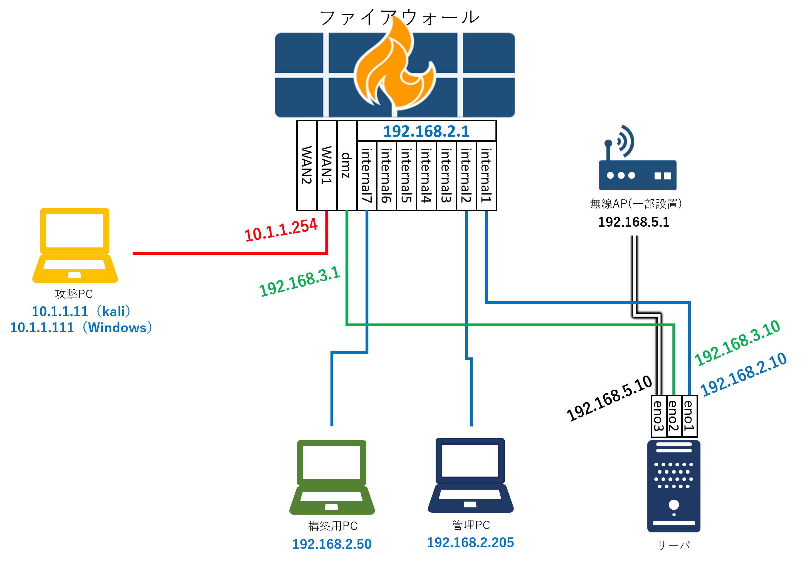

研修環境構築に必要な機器
=================================================

研修環境の構築に必要な機器及び用途を紹介する。  
研修実施時に1人、もしくは1グループが独立して扱う演習環境一式を1環境と呼ぶことにする。  
（例えば、3人ずつのグループが2つあり、それぞれ独立して演習を行いたい場合は2環境用意する必要がある）

# 必ず用意したい機器
本研修環境構築に必要な機器を紹介する。

## サーバ
1環境あたり1台必要。
ハイパーバイザを介して複数の仮想サーバを立ち上げる。  

本プロジェクトで実際に使用したサーバの使用は以下の通り。

- CPU：Xeon E-2314
- メモリ：32GB
- HDD：1TB
- LANポート：4ポート（最低2ポート、アクセスポイントを使用する場合は3ポート必要）

## PC
1環境あたり3台必要。構築用・管理用・攻撃用で使用する。  
本プロジェクトで実際に使用したPCの仕様は以下の通り。

- OS：Windows 11
- CPU：Inter(R) Core i3
- メモリ：16GB
- SSD：512GB
- LANポート：1ポート（最低限1ポート必要）

## ファイアウォール
1環境あたり1台必要。  
研修内でファイアウォールの設定を行うため設定を行いやすいWeb用管理コンソールがあると便利である。

## LANケーブル
研修では下図のような配線を行うため、1環境あたりLANケーブルが5本必要になる。  
アクセスポイントを使用して研修用Webツールに接続する場合はプラス1本必要になる。

# 用意することが好ましい機器
必須ではないが、本研修実施にあたって用意すると便利な機器を紹介する。

## アクセスポイント
集合研修で複数のグループを作ってそれぞれが別の環境を扱う場合、  
ある1台のサーバに用意した1つの研修用Webツールに全グループのPCを接続させると  
管理者側で研修の進捗管理を一元的に行うことができて便利である。  
それはアクセスポイントを用意して研修用Webツールに繋がるように接続することで実現できる。  

## スイッチ
基本的にはファイアウォールの物理インタフェースのみで十分だが、  
ファイアウォールの物理ポートの数が少ない場合や追加で多くの機器を研修環境に接続する場合は必要になる可能性がある。

## 外部記憶媒体
本研修ではPCやファイアウォールの設定変更を行うため、研修後に研修前の環境にロールバックさせるために、  
PC及びファイアウォールの研修用環境や研修用コンフィグファイルを保存しておくために外部記憶媒体があると便利である。

## モニタ
集合研修実施時、1環境を複数人のグループで扱う場合に、1人が扱っているPCの画面をグループメンバー全員で確認することができるため、準備しておきたい。

