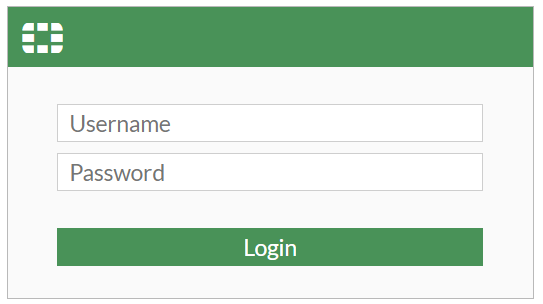
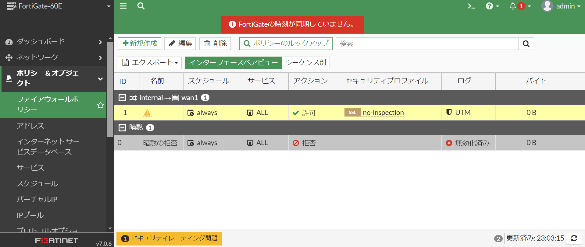

ファイアウォールの環境構築について
========================================

# 研修環境構築
本章では、構築研修を行うための環境構築（ファイアウォール：FW）について記載する。

## 前提
FWとしてFortinet FortiGate-60Eを使用。FortiOSはv7.0.6。
 
PCのIPアドレスは第3オクテットまで192.168.1、第4オクテットを0、99、255を除く数字に設定する。

## 構築演習前環境の構築手順

### FWへのログイン

1. FWのinternal port 1とPCをLANケーブルで接続する。

1. ブラウザを開き、`https://192.168.1.99`にアクセスする。

1. ログイン画面で、以下の情報を入力し、「ログイン」を押す。
    - ユーザ名：admin
    - パスワード：空白
    - 

1. パスワード変更の画面が出るため、以下の情報を入力し、「OK」を押す。
    - Old Password：空白
    - New Password：Passw0rd!
    - Confirm Passw0rd：Passw0rd!
    - 

1. 再度ログイン画面が出るため、以下の情報を入力し、「ログイン」を押す。
    - ユーザ名：admin
    - パスワード：Passw0rd!

1. Fortigateのダッシュボード（英語表記）が表示される。
    - 

### 画面の日本語化

1. 左側のペインから[System] -> [Settings]を選択する。
    - 

1. 中央のペインから[View Settings]の[Language]はJapaneseを選択し、「Apply」を押す。
    - 

1. ForitiGateのダッシュボード（日本語表記）が表示される。
    - 

### インターフェースの設定

#### internal
internal用セグメントのインターフェースの設定を下記の手順で実施する。

1. 左側のペインから[ネットワーク] -> [インターフェース]を選択する。
    - 

1. 中央のペインから[ハードウェアスイッチ] -> [internal]を右クリックし、「編集」を押す。
    - 

1. 中央のペインから[アドレス]の[IP/ネットマスク]に、`192.168.2.1/255.255.255.0`を入力する。
    - 

1. 中央のペインから[DHCPサーバ]のトグルをOFFにする。
    - 

1. 中央のペインから[その他] -> [ステータス]を「有効化済み」に変更する。

1. 「OK」を押し、設定を反映する。

#### WAN1
WAN1用セグメントのインターフェースの設定を下記の手順で実施する。

1. 左側のペインから[ネットワーク] -> [インターフェース]を選択する。

1. 中央のペインから[物理インターフェース] -> [wan1]を右クリックし、「編集」を押す。

1. 中央のペインから[アドレス -> [アドレッシングモード]を「マニュアル」に変更する。

1. 中央のペインから[アドレス]の[IP/ネットマスク]に、`10.1.1.254/255.255.255.0`を入力する。

1. 中央のペインから[管理者アクセス] -> [IPv4]に、HTTP・HTTPS・SSHのチェックを追加する。
    - 

1. 中央のペインから[その他] -> [ステータス]を「有効化済み」に変更する。

1. 「OK」を押し、設定を反映する。

### ポリシーの設定
初期状態で入っているinternal to wan1の設定を下記の手順で実施する。

1. 左側のペインから[ポリシー&オブジェクト] -> [ファイアウォールポリシー]を選択する
    - 

1. 中央のペインから[internal→wan1]の下の項目を右クリックし、「編集」を押す。
    - 

1. 中央のペインから[名前]に、`internal_to_wan1`を入力する。
    - 

1. 中央のペインから[ファイアウォール/ネットワークオプション] -> [NAT]のトグルはONにする。
    - 

1. 「OK」を押し、設定を反映する。

以上の手順により、構築演習前環境の構築が完了する。

## 構築演習後環境の構築手順
### インターフェースの設定
#### DMZ
構築演習前環境の構築においてInternalとWAN1の設定を行ったため、残りのDMZについて設定を実施する。

1. 左側のペインから[ネットワーク] -> [インターフェース]を選択する。

1. 中央のペインから[物理インターフェース] -> [dmz]を右クリックし、「編集」を押す。

1. 中央のペインから[アドレス -> [アドレッシングモード]を「マニュアル」に変更する。

1. 中央のペインから[アドレス]の[IP/ネットマスク]に、`192.168.3.1/255.255.255.0`を入力する。

1. 中央のペインから[管理者アクセス] -> [IPv4]に、PINGのチェックを追加する。

1. 中央のペインから[その他] -> [ステータス]を「有効化済み」に変更する。

1. 「OK」を押し、設定を反映する。

### ポリシーの設定
#### internal to dmz

1. 左側のペインから[ポリシー&オブジェクト] -> [ファイアウォールポリシー]を選択する
    - 

1. 中央のペインから[新規作成]を選択する。

1. 中央のペインから、以下のとおり入力する。
    - [名前]に、`internal_to_dmz`を入力する。
    - [着信インターフェース]は、internalを選択する。
    - [発信インターフェース]は、dmzを選択する。
    - [送信元]は、allを選択する。
    - [宛先]は、allを選択する。
    - [サービス]は、ALLを選択する。
        - 

1. 中央のペインから[ファイアウォール/ネットワークオプション] -> [NAT]のトグルはOFFにする。
    - 

1. 「OK」を押し、設定を反映する。

#### dmz to internal
1. 左側のペインから[ポリシー&オブジェクト] -> [ファイアウォールポリシー]を選択する

1. 中央のペインから[新規作成]を選択する。

1. 中央のペインから、以下のとおり入力する。
    - [名前]に、`dmz_to_internal`を入力する。
    - [着信インターフェース]は、dmzを選択する。
    - [発信インターフェース]は、internalを選択する。
    - [送信元]は、allを選択する。
    - [宛先]は、allを選択する。
    - [サービス]は、ALLを選択する。

1. 中央のペインから[ファイアウォール/ネットワークオプション] -> [NAT]のトグルはOFFにする。

1. 「OK」を押し、設定を反映する。

#### dmz to wan
1. 左側のペインから[ポリシー&オブジェクト] -> [ファイアウォールポリシー]を選択する

1. 中央のペインから[新規作成]を選択する。

1. 中央のペインから、以下のとおり入力する。
    - [名前]に、`dmz_to_wan`を入力する。
    - [着信インターフェース]は、dmzを選択する。
    - [発信インターフェース]は、wan1を選択する。
    - [送信元]は、allを選択する。
    - [宛先]は、allを選択する。
    - [サービス]は、ALLを選択する。

1. 中央のペインから[ファイアウォール/ネットワークオプション] -> [NAT]のトグルはONにする。

1. 「OK」を押し、設定を反映する。

#### wan to dmz
1. 左側のペインから[ポリシー&オブジェクト] -> [ファイアウォールポリシー]を選択する

1. 中央のペインから[新規作成]を選択する。

1. 中央のペインから、以下のとおり入力する。
    - [名前]に、`wan_to_dmz`を入力する。
    - [着信インターフェース]は、wanを選択する。
    - [発信インターフェース]は、dmzを選択する。
    - [送信元]は、allを選択する。
    - [宛先]は、allを選択する。
    - [サービス]は、DNSとHTTPを選択する。

1. 中央のペインから[ファイアウォール/ネットワークオプション] -> [NAT]のトグルはONにする。

1. 「OK」を押し、設定を反映する。

以上の手順により、構築演習後環境の構築が完了する。