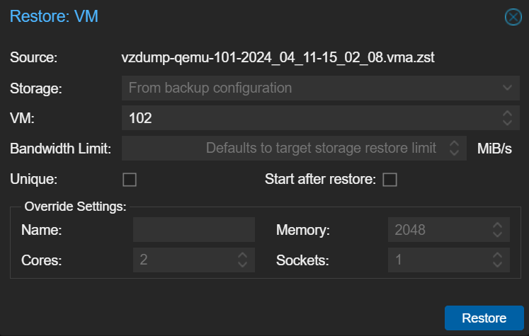

Proxmox Virtual Environment (Proxmox VE) 操作手順
=================================================

オープンソースの仮想化環境である、Proxmox Virtual Environment (以下 Proxmox VE)
のセットアップ手順および各種操作手順について記載する。

# インストールおよび初期設定手順

## インストール用USBメモリの作成

- ダウンロード
    - https://www.proxmox.com/en/downloads から、Proxmox VE x.x ISO Installerをダウンロードする。
        - 本手順作成時点ではバージョン8.1。
- USBメモリへの書き込み
    - ダウンロードしたISOファイルをUSBメモリに書き込む。
    - ツール例: Rufus, balenaEtcher

## インストーラ起動手順

- ISOイメージを書き込んだUSBメモリをインストール先サーバーに接続し起動する。
- UEFIファームウェア設定画面を操作し、USBメモリから起動する。(詳細手順は使用するサーバーにより異なる)
- Install Proxmox VE (Graphical) を選択する。

## インストーラ操作手順

- END USER LICENSE AGREEMENT 画面: 右下の I agree を選択する。
- Target Harddisk: /dev/sda を選択した状態で Next を選択する。
    - (オプション)ディスクサイズを変更したい場合は Next を選択する前に下記の手順を実施する。
        - options を選択する。
            - hdsize: Proxmox VE で使用する全体のディスクサイズ。
                - デフォルトのまま変更の必要なし。
            - maxroot: Proxmox VE ホストが使用するディスクサイズ。
                - Backupはここに置かれるため増加したい場合はディスクサイズを指定する。
            - 他の項目は空欄のままでよい。
- Location and Time Zone: 下記の設定とする。
    - Country: Japan
    - Time zone: Asia/Tokyo
    - Keyboard Layout: Japanese
- Administration Password and Email Address: 下記の設定とする。
    - Password: Passw0rd!
    - mail: mail@example1.invalid
- Management Network Configuration: 下記の設定とする。
    - Hostname (FQDN): pve.example1.invalid
    - IP Address (CIDR): 192.168.2.10/24
    - Gateway: 192.168.2.1
    - DNS Server: (使用時のネットワーク環境に合わせる)
- Summary
    - 確認して Install を実行する。

## 初期設定

- 再起動後、https://192.168.2.10:8006/ に接続する。
- 「この接続ではプライバシーが保護されません」や「警告: 潜在的なセキュリティリスクあり」といった警告が出た場合は無視して進む。
- User name: "root", Password: "Passw0rd!" を入力してログインする。
- No valid subscription という警告が出るがOKを押して進む。
- Enterprise レポジトリの無効化設定:
    - Datacenterの下にあるpveを選択
    - Updatesの下にあるRepositoriesを選択
    - `https://enterprise.proxmox.com/debian/pve` を選択
    - Disableをクリック
    - 同様に、 `https://enterprise.proxmox.com/debian/ceph-quincy` を選択
    - Disableをクリック
    - 
- No-Subscription レポジトリの追加:
    - 引き続き Add をクリック
    - `No-Subscription` を選択し Add をクリック
    - 
- アップグレード実施:
    - サーバーをインターネットに接続する。
    - Updates をクリックし、右の画面で Refresh をクリックし、警告画面はOKを押す。
    - Update package database の画面が出るため、完了後閉じる。
        - 
    - Upgrade をクリックする
        - `Do you want to continue? [Y/n]` に対して Y を入力する。
        - 成功してシェルに戻ったらexitする。
    - Reboot する
        - Datacenterの下にあるpveを選択する。
        - Rebootをクリックする。
        - 

# 各種操作手順

## ISOイメージのアップロード

- ISOイメージのアップロード
    - 左のペインより pve -> local (pve) を選択
    - ISO Images -> Upload
    - ファイルをアップロードする

### 補足: ストレージについて
- local (pve) と local-lvm(pve) がある
    - 
- local:
    - Proxmox VEがインストールされているDebian OS内のディレクトリである。
    - 実体は `/var/lib/vz/` である。
    - ホストOS(Debian)本体、ISOイメージ、Backup、OVFなどが置かれる。
- local-lvm: ファイルシステムが作られていないブロックデバイスであり、ファイルを置くことができない。
    - 実体は、 `lvdisplay` コマンドで表示される 'data' という名前の Loical Volume である
- 詳細: https://pve.proxmox.com/wiki/Storage

## VM作成

- 左の一覧でpveが選択された状態で、右上の"Create VM"をクリックする

## VM削除

- pve内のVM名をクリック
- 右上の"More"をクリックし、"Remove"を選択
- 
- ポップアップウィンドウが出てくる
- 削除したいVMの番号を入れて"Remove"をクリックするとVMが削除される
- 

## VMのロック解除

- VMを操作しているときにロックされたままの状態(図参照)になってしまうことがある。
    - 
- 解除方法
    - Shellを開く
    - qm unlock <VMのID>

## ネットワークインターフェースの追加

- pve > Network > Create > Linux Bridge と操作する。
    - 
- IPv4/CIDR の欄にIPアドレスおよびサブネットマスク長を入力し、Bridge portsの欄にNICのインターフェース名を入力し、Createをクリックする。
    - 
- 設定ファイル (`/etc/network/interfaces`) の変更内容が表示されるので、確認後 Apply Configuration をクリックする。
    - 

## 別の Proxmox VE ノードへのVM移植

- 概要
    - Proxmoxでバックアップしたvmaファイルを、別のProxmoxでリストアする（[公式ドキュメント](https://pve.proxmox.com/wiki/Backup_and_Restore)） 
- 手順
    - 仮想マシンのバックアップ
        - ツリーからバックアップしたい仮想マシンを選択し、Backup->Backup nowを押す  
            - 
        - ダイアログで設定を確認し、Backupを押す  
            - 
        - /var/lib/vz/dumpに圧縮ファイル（~.vma.zsdt）が生成される
    - 圧縮ファイルの転送
        - WinSCPなどで圧縮ファイルをインポートしたいサーバに転送する
            - 転送先は任意だが、/var/lib/vz/dumpを推奨
    - 仮想マシンのリストア
        - ツリーからlocal(pve)を選択し、リストアしたい~vma.zsdtを選択後、Backup->Restoreを押す  
            - 
        - ダイアログで設定を確認し、Restoreを押す（基本デフォルト）  
            - 
        - リストアが完了すると、ツリーのpve配下に仮想マシンが現れる。
