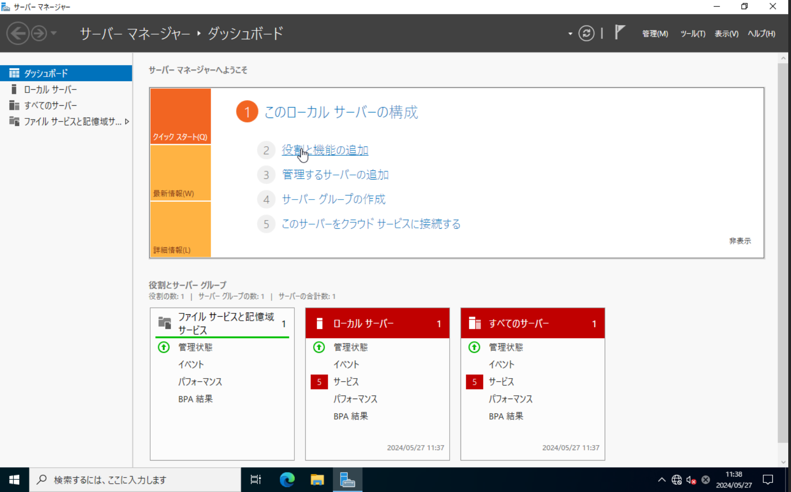
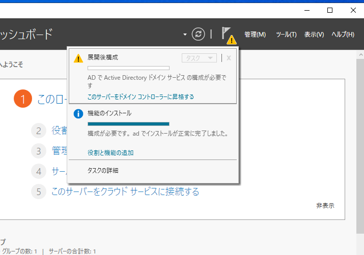
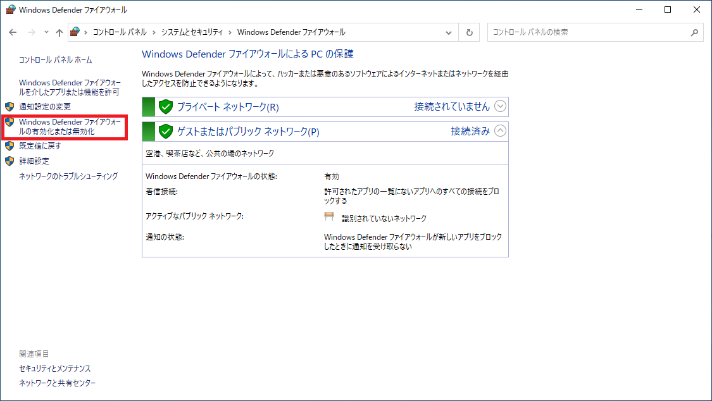
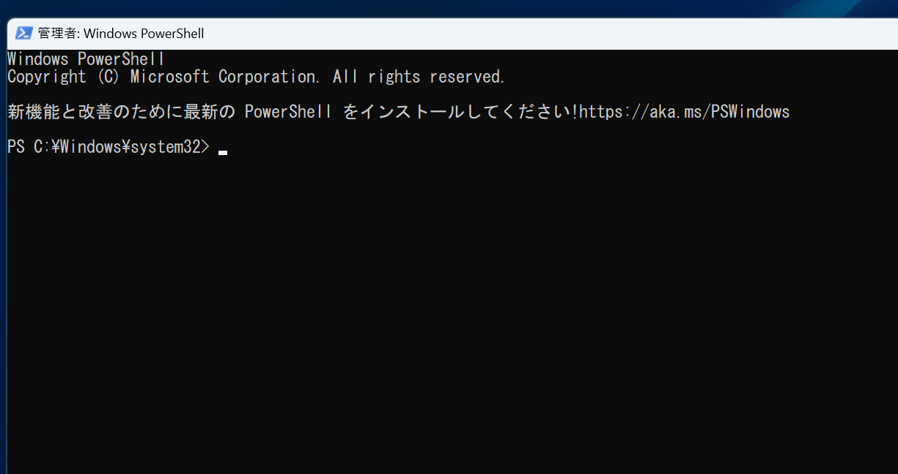

ADサーバーの環境構築について
========================================

# 概要

本ファイルでは、攻撃・対策実装を行うための環境構築（ADサーバー）について記載する。

## 前提
仮想マシンにWindows Server 2022をインストールしていること。 

## 構築演習前環境の構築手順

### 役割と機能の追加

1. サーバーマネージャーから役割と機能の追加を選択し、「役割と機能の追加ウィザード」を起動する。
    - 

1. [開始する前に]では「次へ」を選択する。
    - 

1. [インストールの種類の選択]では「次へ」を選択する。
    - 

1. [対象サーバーの選択]では「次へ」を選択する。
    - 

1. [サーバーの役割の選択]では「Active Directory ドメインサービス」を選択する。
    - 

1. 表示されたダイアログで「機能の追加」を選択する。
    - 

1. [サーバーの役割の選択]のウィザードに戻り、次は「DNSサーバ」を選択する。
    - 

1. 表示されたダイアログで「機能の追加」を選択する。
    - 

1. [機能の選択]では「次へ」を選択する。
    - 

1. [Active Directory ドメインサービス]では「次へ」を選択する。
    - 

1. [DNSサーバー]では「次へ」を選択する。
    - 

1. [インストールオプションの確認]では「必要に応じて対象サーバーを自動的に再起動する」にチェックを入れる。 ダイアログが出てくるので、「はい」を選択する。
    - 

1. 「インストール」を選択する。  
    - 

### ドメインコントローラの設定

1. 上記の設定が完了したら、サーバーマネージャーのダッシュボードにて通知マークを選択。
    - 

1. 「このサーバーをドメインコントローラーに昇格する」を選択。   
    - 

1. ActiveDirectoryドメインサービス構成ウィザードの[配置構成]で「新しいフォレストを追加する」を選ぶ。「ルートドメイン名」で、「salgroup.local」を入力して、その後「次へ」を選択。
    - 

1. [ドメインコントローラーオプション]の「フォレストの機能レベル」と「ドメインの機能レベル」で「Windows Server 2016」を選択。

1. 「ディレクトリサービス復元モード（DSRM）のパスワードを入力してください」で「Passw0rd!」と入力する。その後、「次へ」を選択。

    - 

1. [DNSオプション]では「次へ」を選択。

    - 

1. [追加オプション]では「次へ」を選択。

    - 

1. [パス]は「次へ」を選択。

    - 

1. [オプションの確認]で内容を確認し、問題がなければ、「次へ」を選択。

    - 

1. [前提条件のチェック]にて、「すべての前提条件のチェックに合格しました。[インストール]をクリックしてインストールを開始してください」と表示されていることを確認し、「インストール」を選択。

    - 

1. インストールが完了した後は、自動的に再起動する。

1. 「再起動」のポップアップが表示されるので、「再起動する」を選択。

1. 再起動後、「salgroup\administrator」でログインできることを確認する。

### Windowsファイアウォールの無効化

1. デスクトップの検索バーに「cont」と入力し、候補に現れる「コントロールパネル」を選択。

    - 

1. 「コントロールパネル」で「システムとセキュリティ」を選択。

    - 

1. 「システムとセキュリティ」で「Windows Defender ファイアウォール」を選択。

    - 

1. 「Windows Defender ファイアウォール」で「Windows Defender ファイアウォールの有効化または無効化」を選択。

    - 

1. 「設定のカスタマイズ」の「各種類のネットワーク設定のカスタマイズ」で、「プライベートネットワークの設定」および「パブリックネットワークの設定」の「Windows Defender ファイアウォールを無効にする(推奨されません)」にチェックを入れ、OKを選択する。

    - 

以上の手順により、構築演習前環境の構築が完了する。

## 構築演習後環境の構築手順

### ADサーバでのドメインユーザ(example)作成

- ここからはユーザ作成及び管理PCのドメイン参加、適切な権限付与を行う。

- ドメインユーザ（example）を作成する
    - 設定手順-ドメインユーザ作成
        1. 「スタートボタン（windowsマーク）」をクリックし、「サーバマネージャー」を選択する。

        1. 表示されたウインドウの右上の「ツール」をクリック。  
        
        1. 「Active Directory ユーザーとコンピューター」をクリック。  
            - 
        
        1. 左側のペイン内の「salgroup.local」配下の「Users」を右クリック。  
        
        1. 「新規作成」をクリック後、「ユーザー」をクリック。
            - 
        
        1. 「新しいオブジェクト-ユーザー」にて、「フルネーム」と「ユーザーログオン名」に好きな名前を入力し、「次へ」をクリック。  
            - 以降、資料上では名前はexampleとして進める。exampleは各自で決めた名前に読み替えて作業を行う。
            - 

        1. パスワードを確認されるので、以下のパスワードを入力。  
            - パスワード：Passw0rd!  
        
        1. 「ユーザは次回ログオン時にパスワード変更が必要」のチェックは外し、「次へ」をクリック。
            - 
        
        1. 「完了」をクリック。
            - 
        
        1. Usersを見ると、ユーザとして"example"ができていることが分かる。
            - 

### PCのドメイン参加
- ADサーバで作成した"example"ユーザで管理PCにログインできるように設定をする。
    1. 管理PCにlocaladmin(ローカルユーザ)でログインする。  
      その際は以下のユーザ名、パスワードでログインする。
        - ユーザ名：localadmin
        - パスワード：Passw0rd!  

    1. スタートボタン（windowsのマーク）を右クリックし、その後「システム」をクリック。
    
    1. 「ドメインまたはワークグループ」をクリック。
        - 
    
    1. 「システムのプロパティ」にて「コンピュータ名」のタブを選択し、「変更」をクリック。
        - 

    1. 「コンピュータ名/ドメイン名の変更」にて、「ドメイン」にチェックを入れる。 
        その後、下の入力スペースに「salgroup.local」を入力して、「OK」をクリックする。 
        ※コンピューター名は特に変更しない。
        - 

    1. 「Windowsセキュリティ」のポップアップが表示されるので、以下のユーザ名とパスワードを入力する。その後、「OK」をクリック。
        - ユーザ名:example
        - パスワード:Passw0rd!
            - 

    1. 「salgroup.localドメインへようこそ」と表示されるので、「OK」をクリック。  
        - 
    
    1. 続いて、「これらの変更を適用するには、～再起動する必要があります」と表示されるが、同じく「OK」をクリック。
        - 
    
    1. 「システムのプロパティ」を「閉じる」をクリックし、続いて表示される「Microsoft Windows」で「今すぐ再起動する」をクリック。
        - 

    1. 再起動後、ログイン画面で「他のユーザー」を選択。  
    
    1. 以下のユーザ名とパスワードでログインできることを確認する。
        - ユーザ名:salgroup.local\example
        - パスワード:Passw0rd!
        - 

    1. コマンドプロンプトにて"whoami"コマンドを入力し、ユーザ名が"salgroup¥example"と表示されていれば、ドメイン参加成功。
        - 
    
    1. exampleを管理PCからサインアウトする。

### ドメインユーザへの権限付与
- ドメインユーザのexampleをローカルの管理者グループであるAdministratorsに追加する。

    1. まずは、元々Administratorsグループに属している、ローカルユーザのlocaladminで管理PCにログインする。 
    ※ローカルユーザにログインする場合は、ユーザ名の前に「.\」をつけること。(例：.\localadmin)  

    1. スタートボタンを右クリックし、「コンピュータの管理」をクリック。

    1. 「ローカルユーザーとグループ」をクリックし、「グループ」をクリック。  

    1. Administratorsを右クリックし「プロパティ」を選択。
        - 

    1. 下部にある「追加」をクリック。
        - 

    1. 「選択するオブジェクト名を入力してください」にexampleと入力。
        - 

    1. 「名前の確認」をクリック。
        - 

    1. ネットワーク資格情報を確認されるので、以下のユーザー名とパスワードを入力し、「OK」をクリック。
        - ユーザ名:example
        - パスワード:Passw0rd!
        - 
        - 

    1. OKをクリック。  

    1. Administratorのプロパティにexampleが追加されていることを確認し、「適用」をクリック。その後、「OK」をクリック。
        - 

    1. localadminを管理PCからサインアウトし、exampleでログインできることを確認する。    

    1. スタートをクリックし、検索バーでWindows PowerShellを入力。  
    
    1. 検索結果にWindows PowerShellが表示されるので、右クリックして「管理者として実行」をクリック。
        - 
    
    1. ユーザアカウント制御のポップアップが出るが、「OK」をクリックする。  
    
    1. ここでパスワードを確認されずに以下のターミナルが起動すればOK。
        - 

### ADサーバでのドメインユーザ（kanri）作成
- ログインしたADサーバでドメインユーザ"kanri"を作成する。  

- このkanriはADサーバを管理するためのユーザとして運用する想定であり、セキュリティグループのDomainAdminsに参加させることで強い権限を持たせる。 
※DomainAdminsとはドメインの管理者を意味するセキュリティグループである。  
  - 設定手順-ドメインユーザ作成
    1. ドメインユーザexampleを作成したときと同じ流れでADサーバの仮想マシンにログインする。  

    1. 「スタートボタン（windowsマーク）」をクリックし、「サーバマネージャー」を選択する。
        - 

    1. 表示されたウインドウの右上の「ツール」をクリック。  
    
    1. 「Active Directory ユーザーとコンピューター」をクリック。
        - 
    
    1. 左側のペイン内のsalgroup.local配下のUsersを右クリック。  
    
    1. 新規作成をクリック後、ユーザーをクリック。
        - 
    
    1. 新しいオブジェクト-ユーザーにて、フルネームとユーザーログオン名に”kanri”を入力し、次へをクリック。
        - 

    1. パスワードを確認されるので、"Passw0rd!"を入力。 
    「ユーザは次回ログオン時にパスワード変更が必要」のチェックは外し、次へをクリック。  
    
    1. 完了をクリック。  
    
    1. Usersを見ると、ユーザとしてkanriができていることが分かる。
        - 

  - 設定手順-kanriにドメイン管理者権限を付与
    1. 引き続きADサーバを操作し、Usersのkanriを右クリック。  

    1. プロパティをクリックし、kanriのプロパティが出てくる。  

    1. kanriのプロパティから所属するグループをクリック。
        - 

    1. 追加をクリック。  

    1. 選択するオブジェクトを入力してくださいに”Domain Admins”と入力し、名前の確認をクリック。
        - 

    1. OKをクリック。  

    1. kanriのプロパティで所属するグループにDomain Adminsが追加されていることが分かる。
        - 

    1. OKをクリック。  

    1. exampleを管理PCからサインアウトし、kanriでログインする。  

    1. スタートをクリックし、検索バーでWindows PowerShellを入力。  

    1. 検索結果にWindows PowerShellが表示されるので、右クリックして管理者として実行をクリック。
        - 

    1. ユーザアカウント制御のポップアップが出るが、OKをクリックする。  

    1. ここでパスワードを確認されずに以下のターミナルが起動すればOK。
        - 

以上の手順により、構築演習後環境の構築が完了する。