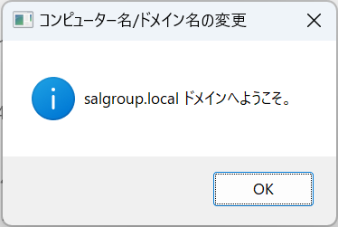

ファイルサーバーの環境構築について
========================================

# 概要

本ファイルでは、攻撃・対策実装を行うための環境構築（ファイルサーバー）について記載する。

## 前提
仮想マシンにWindows Server 2022をインストールしていること。 

## 構築演習前環境の構築手順

### ドメイン参加

1. Windowsマークを右クリックし、「システム」を選択する。
    

1. 詳細情報ウィンドウの[関連設定]内にある、「このPCの名前を変更（詳細設定）」を選択する。
    

1. システムのプロパティの[コンピューター名]タブ内にある、「変更」を選択する。
    

1. [所属するグループ]は「ドメイン」を選択し、「salgroup.local」と入力し、「OK」を選択する。
    

1. Windowsセキュリティのポップアップが表示されるため、ユーザー名に「fsadmin」、パスワードに「Passw0rd!」と入力し、「OK」を選択する。
    

1. 「salgroup.localドメインへようこそ」と表示されるので、「OK」を選択する。
    

1. 「これらの変更を適用するには、～再起動する必要があります」と表示されるが、「OK」を選択する。
    

1. 「システムのプロパティ」を「閉じる」を選択し、続いて表示される「これらの変更を適用するには、～再起動する必要があります」で「今すぐ再起動する」を選択する。
    

1. 再起動後、ログイン画面で「他のユーザー」を選択する。

1. ユーザー名「fsadmin」でログインし、Windows Server 2022が起動することを確認する。

### Windows ファイアウォールの無効化

1. デスクトップの検索バーに「cont」と入力し、候補に現れる「コントロールパネル」を選択する。
    

1. 「コントロールパネル」で「システムとセキュリティ」を選択する。
    

1. 「システムとセキュリティ」で「Windows Defender ファイアウォール」を選択する。
    

1. 「Windows Defender ファイアウォール」で「Windows Defender ファイアウォールの有効化または無効化」を選択する。
    

1. 「設定のカスタマイズ」の「各種類のネットワーク設定のカスタマイズ」で、「プライベートネットワークの設定」および「パブリックネットワークの設定」の「Windows Defender ファイアウォールを無効にする(推奨されません)」にチェックを入れ、「OK」を選択する。
    

以上の手順により、構築演習前環境の構築が完了する。

## 構築演習後環境の構築手順

### 役割と機能の追加

1. サーバーマネージャーから役割と機能の追加を選択し、「役割と機能の追加ウィザード」を起動する。
    - 

1. [開始する前に]では「次へ」を選択する。
    - 

1. [インストールの種類の選択]では「次へ」を選択する。
    - 

1. [対象サーバーの選択]では「次へ」を選択する。
    - 

1. [サーバーの役割の選択]では「ファイルサービスと記憶域サービス」->「ファイルサービスおよびiSCSIサービス」->「ファイルサーバー」を選択する。
    - 

1. [機能の選択]では「次へ」を選択する。
    - 

1. [インストールオプションの確認]では「インストール」を選択する。
    - 

1. 上記の設定が完了したら、再起動を行う。  

### 共有フォルダの設定

1. fsadminでファイルサーバーにログインする  

1. ファイルエクスプローラーを開き、Cドライブ直下に移動する。  

1. 「Share」という新しいフォルダーを作成する。  

1. 「Share」の配下に、「Share\_Folder」と「Secret\_Folder」という新しいフォルダーを作成する。  

#### Share

1. Shareを右クリックし、プロパティ->「共有」タブ->ネットワークのファイルとフォルダーの共有を開き、「共有」を押す。
    - 

1. ネットワークアクセスが起動し、入力欄に「Everyone」と入力し、「追加」を押す。その後、「アクセス許可のレベル」を「読み取り/書き込み」に変更する。最後に「共有」を押す。
    - 

#### Share\_Folder

1. Share\_Folderを右クリックし、プロパティ->「共有」タブ->ネットワークのファイルとフォルダーの共有を開き、「共有」を押す。  

1. ネットワークアクセスが起動する。  

1. 「Everyone」を選択し、削除する。  

1. 、入力欄に「Domain Users」と入力し、「追加」を押す。  

1. アクセス許可のレベルを「読み取り/書き込み」に変更し、「共有」を押す。  

1. フォルダの中に、「公開情報.txt」というテキストファイルを作成し保存する。  

#### Secret\_Folder

1. Secret\_Folderを右クリックし、プロパティ->「共有」タブ->ネットワークのファイルとフォルダーの共有を開き、「共有」を押す。  

1. ネットワークアクセスが起動する。  

1. 「Everyone」を選択し、削除する。  

1. 、入力欄に「Domain Admins」と入力し、「追加」を押す。  

1. アクセス許可のレベルを「読み取り/書き込み」に変更し、「共有」を押す。  

1. フォルダの中に、「顧客情報.txt」というテキストファイルを作成し保存する。  

以上の手順により、構築演習後環境の構築が完了する。