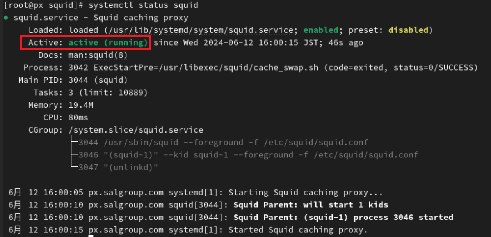

Proxyサーバーの環境構築について
========================================

# 概要

本ファイルでは、対策実装を行うための環境構築（Proxyサーバー）について記載する。

## 前提
仮想マシンにAlmaLinuxをインストールした直後の状態から構築を始める。

## 環境構築手順


### squidのインストール
AlmaLinux上で「端末」（ターミナル）を開く


※以降はターミナル上で、コマンドの入力やファイルの編集をしていく

root権限に変更する　※ここからの作業は全てroot権限で行う
```
su
```

squidをインストールする
```
dnf -y install squid
```

### コンフィグファイルの編集

コンフィグファイルのあるディレクトリに移動する
```
cd /etc/squid
```

viエディタでコンフィグファイルを開く
```
vi squid.conf
```

コンフィグファイルを以下の内容に修正する

```
# Squid listens to port 8080
http_port 8080

# Cache and coredump settings
cache_dir ufs /var/spool/squid 100 16 256
cache_mem 256 MB
coredump_dir /var/spool/squid

# Refresh patterns
refresh_pattern ^ftp:           1440  20%  10080
refresh_pattern ^gopher:        1440  0%   1440
refresh_pattern -i (/cgi-bin/|\?) 0   0%   0
refresh_pattern .               0     20%  4320

# Define ACLs
acl localnet src 192.168.2.0/24  # Adjusted to allow 192.168.2.0/24 network
acl SSL_ports port 443
acl Safe_ports port 80  # http
acl Safe_ports port 443 # https
acl Safe_ports port 21  # ftp
acl Safe_ports port 70  # gopher
acl Safe_ports port 210 # wais
acl Safe_ports port 1025-65535 # unregistered ports
acl Safe_ports port 280 # http-mgmt
acl Safe_ports port 488 # gss-http
acl Safe_ports port 591 # filemaker
acl Safe_ports port 777 # multiling http
acl CONNECT method CONNECT

# Allow access from local networks
http_access allow localnet
http_access allow localhost

# Allow CONNECT to SSL ports
http_access allow CONNECT SSL_ports

# Deny all other access to this proxy
http_access deny all

# Access log configuration with custom log format
logformat custom %>a %ui %un [%tl] "%rm %ru HTTP/%rv" %>Hs %<st %Ss:%Sh
access_log /var/log/squid/access.log custom
access_log /var/log/squid/access.log combined
access_log syslog:local6.info combined

# Leave coredumps in the first cache dir
coredump_dir /var/spool/squid
```

編集後、ファイルを保存する

### squidの再起動

以下のコマンドでsquidを再起動させる
```
systemctl restart squid
```

squidが起動しているかを確認するために、以下のコマンドを入力する
```
systemctl status squid
```

「Active」と表示されていれば良い

- 