# Web 環境構築手順

## 構築環境

- ここで構築するWeb環境は以下の「Webシナリオ用」の社外Webサーバである

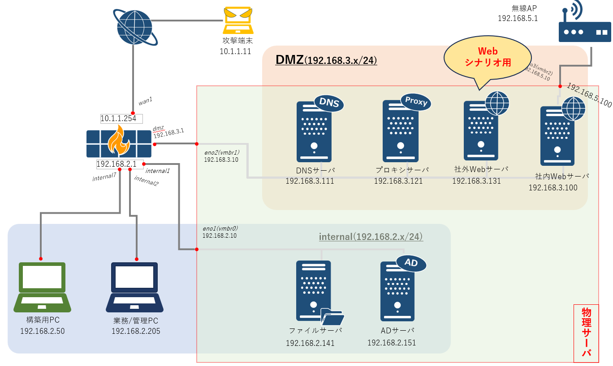

- このWebサイトはWebへのサイバー模擬攻撃が体験できるように脆弱性に作りこんだものである

- 環境情報
    - OS: AlmaLinux
        - 選定理由: 業務で使用されることの多い Red Hat 系でありながら、OSSとして安定版が提供されている
    - Webサーバ: Apache HTTP Server
    - サーバサイドプログラム言語: PHP
    - データベース: MariaDB

## インストール手順

### OSインストール

- 以下のURLより、AlmaLinux OS 9.3 DVD ISOをダウンロードする
    - https://almalinux.org/get-almalinux/#ISO_Images

- ダウンロードしたISOファイルをproxmoxの「local(pve)」にアップロードする

- ProxomoxにログインをしてVMを作成する
    - 画面右上の「Create VM」を選択
    - 以下の設定でVMを作成する
        - Generalタブ
            - VM ID: 131
            - name: web
        - OSタブ
            - ISO image: AlmaLinuxのISOファイル
        - Diskタブ
            - Disk size(GiB): 32
        - CPUタブ
            - Sockets: 1
            - Cores: 1
        - Memoryタブ
            - Memory(MiB): 2048
        - Networkタブ
            - Bridge: vmbr1
    - 作成したVMをスタートする

- OSインストール
    - Install AlmaLinux X.X を選ぶ
        - 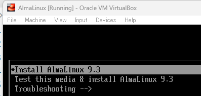
    - 言語画面で、日本語→日本語を選択
        - 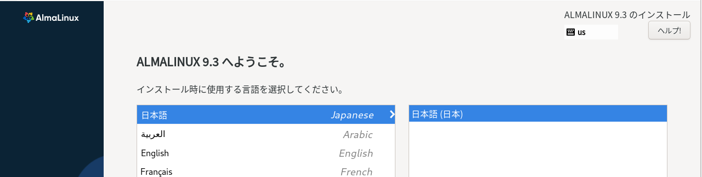
    - 設定画面
        - root パスワードの設定
            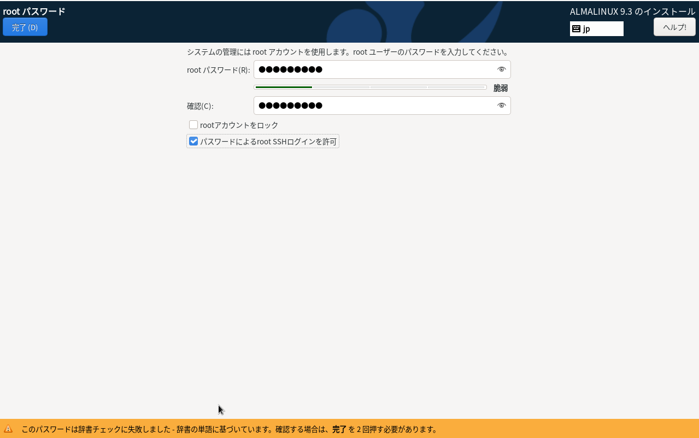
            - パスワードは Passw0rd! とする。
            - 「パスワードによるroot SSHログインを許可」をチェックする
                - この設定を忘れた場合は、 /etc/ssh/sshd_config に "PermitRootLogin yes" という行を追加する
        - ユーザーの作成
            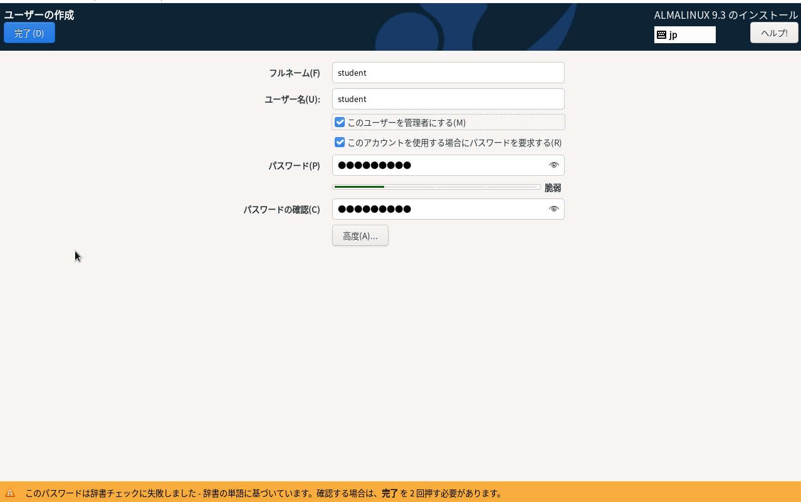
            - ユーザー名 student, パスワード Passw0rd! とする
            - 「このユーザーを管理者にする」をチェックする
        - インストール先
            - 「インストール先」画面に遷移し、設定を変更せずに完了をクリックする
        - 設定完了後インストールを開始する
    - インストール完了したら、再起動をクリックする
        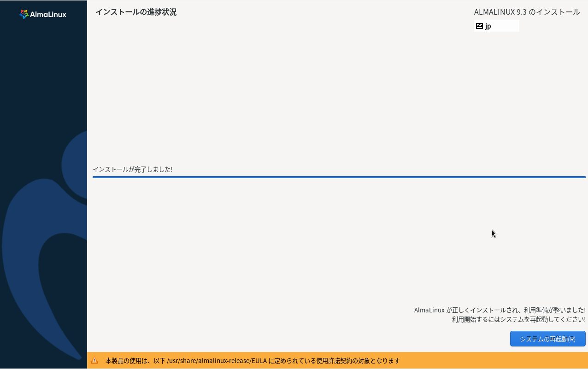 
    - 再起動後、GUIでログインする
        - 「AlmaLinuxへようこそ」の画面は、「必要ありません」をクリックする

### OSインストール後設定

- GUIでrootユーザでログインする

- ネットワーク設定
    - 設定＞ネットワークの歯車マークを押下し、IPアドレスが以下のようになるように、IPv4のタブから設定を行います
        - IPv4アドレス: 192.168.3.131
        - デフォルトルート: 192.168.3.1
        - DNS: 192.168.3.111

        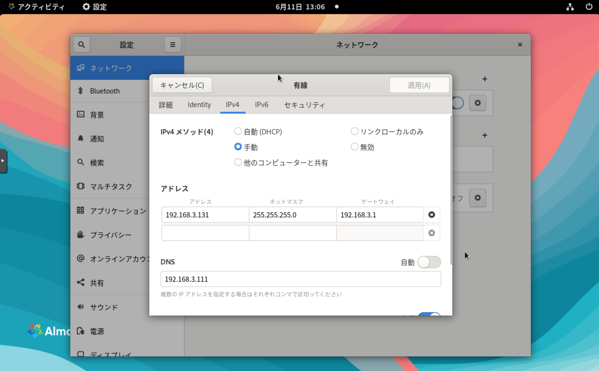 

- hostname 設定
    - 設定＞このシステムについて＞デバイス名を選択し、ホスト名を「www.salgroup.com」に変更します。
        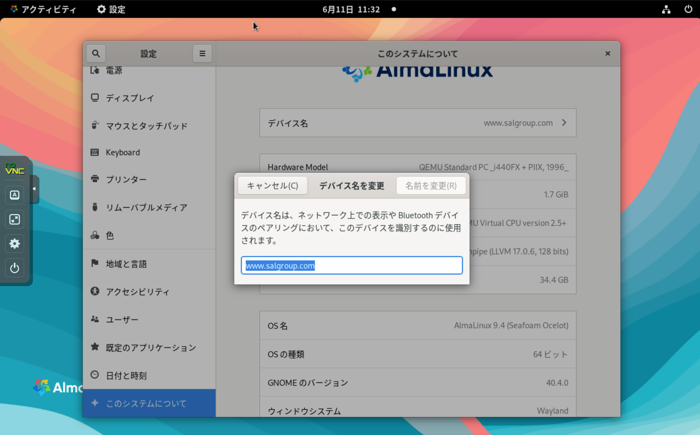 

- デスクトップアイコンの表示
    - RHEL8よりデスクトップアイコンが既定で表示されないため、下記の手順でデスクトップアイコンを表示する
        - アクティビティをクリックし、検索にextensionsといれて「拡張機能」を起動する
            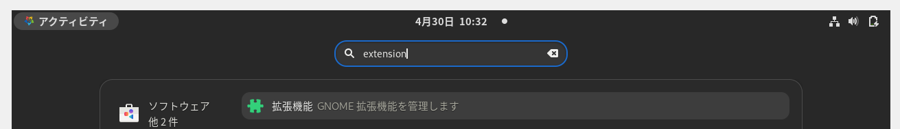
        - 拡張機能をインストールする
            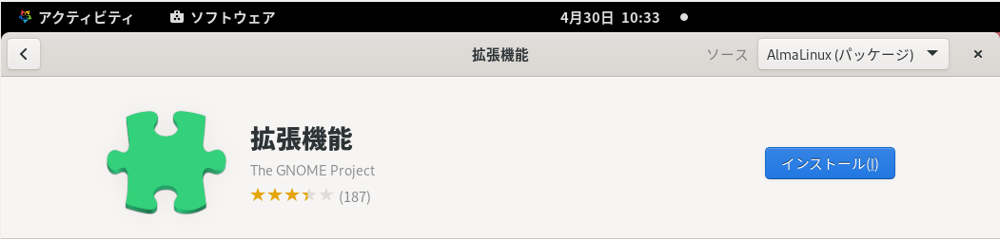
        - インストール完了後拡張機能を開く
        - Applications Menu, Desktop Icons, Window List を有効にする
            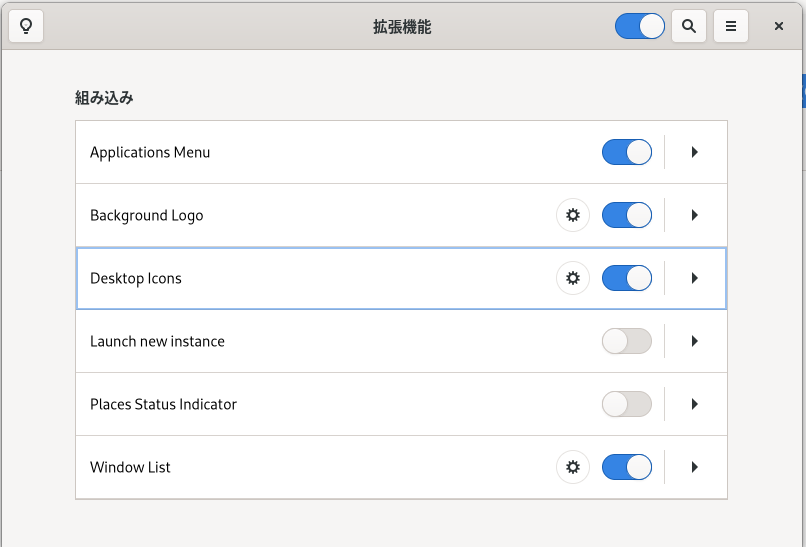

### Apache HTTP Server インストール

- GUI でログイン後、 su を実行して root ユーザーになる
- 実行
    ```
    # dnf -y install httpd
    ```
- サービスが停止していることを確認する
    ```
    [root@localhost ~]# systemctl status httpd
    ○ httpd.service - The Apache HTTP Server
        Loaded: loaded (/usr/lib/systemd/system/httpd.service; disabled; preset: disabl>
        Active: inactive (dead)
        Docs: man:httpd.service(8)
    [root@localhost ~]# httpd -v
    Server version: Apache/2.4.57 (AlmaLinux)
    Server built:   Jul 20 2023 00:00:00
    ```

- サービスの有効化
    - 以下のコマンドでサービスを有効化する
        ```
        # systemctl enable httpd
        ```
    - 以下のコマンドでサービスを開始する
        ```
        # systemctl start httpd
        ```
    - 確認
        - ポート80番でhttpが起動していることを確認する
            ```
            [root@localhost ~]# netstat -tanp | grep 80
            tcp6       0      0 :::80                   :::*                    LISTEN      37809/httpd
            ```
    - 「開始(start)」と「有効化(enable)」の違い
        - 「開始(start)」はサービスを起動するが、再起動時に自動的に実行するようにはならない
        - 「有効化(enable)」は起動時にサービスを自動起動するようになるが、即時に起動はしない
- ホスト型firewallの設定
    - この時点で外部からのhttpアクセスはfirewalldでブロックされている
    - 下記のコマンドでfirewallに対してhttp(80番ポート)の通信を許可する
        ```
        [root@localhost ~]# firewall-cmd --add-service=http --zone=public
        ```
        - 再起動しても設定を残したい場合は --permanent をつける
            ```
            [root@localhost ~]# firewall-cmd --add-service=http --zone=public --permanent
            ```
- 動作確認
    - http://192.168.3.131/ にアクセスし、テストページが表示されることを確認する

### MariaDB インストール

- GUI でログイン後、 su を実行して root ユーザーになる
- 実行
    ```
    # dnf -y install mariadb-server
    ```
- バージョン確認(コマンドはmysqldだが、実際にはMariaDBが起動する)
    ```
    [root@localhost ~]# mysqld --version
    mysqld  Ver 10.5.22-MariaDB for Linux on x86_64 (MariaDB Server)
    ```
- サービス有効化と起動
    ```
    [root@localhost ~]# systemctl enable mariadb
    [root@localhost ~]# systemctl start mariadb
    ```
- 自動的に作成されたユーザーの確認
    ```
    [root@localhost ~]# journalctl -u mariadb -o cat
    Starting MariaDB 10.5 database server...
    Initializing MariaDB database
    Two all-privilege accounts were created.
    One is root@localhost, it has no password, but you need to
    be system 'root' user to connect. Use, for example, sudo mysql
    The second is mysql@localhost, it has no password either, but
    you need to be the system 'mysql' user to connect.
    After connecting you can set the password, if you would need to be
    able to connect as any of these users with a password and without sudo
    See the MariaDB Knowledgebase at https://mariadb.com/kb
    Please report any problems at https://mariadb.org/jira
    The latest information about MariaDB is available at https://mariadb.org/.
    Consider joining MariaDB's strong and vibrant community:
    https://mariadb.org/get-involved/
    Started MariaDB 10.5 database server.
    ```
    - 権限を持ったユーザーが2つ作成されている
        - root@localhost
            - パスワード無し
            - Unix の root ユーザーでないと接続できない
        - mysql@localhost
            - パスワード無し
            - Unix の mysql ユーザーでないと接続できない
- セットアップスクリプトの実行
    - 実行
        ```
        # mysql_secure_installation
        ```
    - 下記のように入力
        - Enter current password for root (enter for none):
            - 何もせずにEnter
        - Switch to unix_socket authentication [Y/n]
            - n
        - Change the root password? [Y/n]
            - Y
            - パスワードとして Passw0rd! を入力
        - Remove anonymous users? [Y/n] Y
        - Disallow root login remotely? [Y/n] n
        - Remove test database and access to it? [Y/n] Y
        - Reload privilege tables now? [Y/n] Y
- 以降、Unixユーザーがrootでない場合であっても、パスワードでRDBのrootユーザーとして認証できるようになる
    - $ mysql -u root -p
        - パスワードを入力
        
### PHP インストール

- PHP 8.1をインストールする
    - 下記を実行
        ```
        [root@localhost ~]# dnf -y module install php:8.1
        ```
    - バージョン確認
        ```
        [root@localhost ~]# php --version
        PHP 8.1.27 (cli) (built: Dec 19 2023 20:35:55) (NTS gcc x86_64)
        ```
- ライブラリをインストール
    ```
    [root@localhost ~]# dnf install php-pdo php-mysqlnd
    ```
- インストール後、Apache HTTP Server を再起動
    ```
    [root@localhost ~]# systemctl restart httpd
    ```
- Apach HTTP Server経由でのPHP動作確認
    - vi /var/www/html/hello.php
        ```
        <?php
        echo "Hello!";
        phpinfo();
        ?>
        ```
    - http://192.168.3.131/hello.php にアクセス

### Webコンテンツの設置

- Webコンテンツのダウンロードを行う
    - GitHubにアクセス: https://github.com/sal-project/sal-websecurity
    - Code > Download ZIPの順にボタンを押下するとダウンロードが開始される
    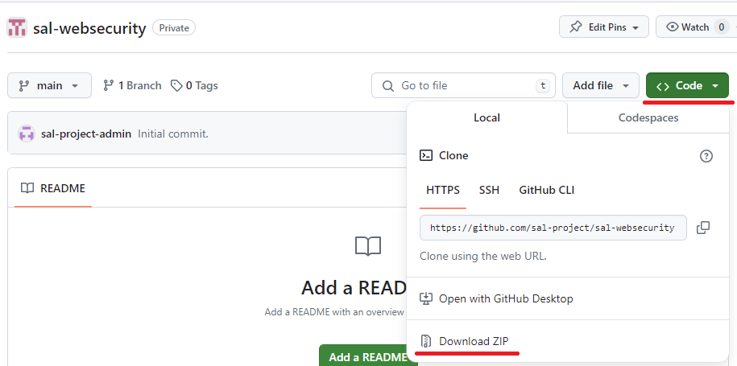

- ダウンロードしたコンテンツを`/var/www/html`配下に配置する
    - 置いたあとの配置
        - /var/www/html/index.html
        - /vaw/www/html/vuln/
            - ...
        - /vaw/www/html/tech/
            - ...
        - /vaw/www/html/secure/
            - ...

- toolフォルダを任意の場所にコピーする

- 以下のコマンドを実行し、データベースにテストデータを注入する。
    ```bash
    cd [コピー場所]
    mysql -u root -p < db-migration.txt
    mysql -u root -p < db-sampledata.txt
    ```

- `http://192.168.3.131/vuln/login.php`にアクセスして、以下の情報でログインを実行する
    - メールアドレス：tanaka@example.com
    - パスワード：password123

- 正常にログインができればWebコンテンツのセットアップは完了

### SSH公開鍵の登録

- 必要に応じてSSH公開鍵を以下の手順で登録し、クライアントPCのVScodeでWebページのソースコードを表示できるようにする

- SSHキーの生成
    - クライアントPCで以下を実行
        ```powershell
        cd C:\Users\member\.ssh\
        ssh-keygen -t ed25519
        ```
    - Enterを3回押下する

- 公開鍵のサーバーへの配置
    - 以下のコマンドを実行して公開鍵の内容を全てコピーする
        ```powershell
        notepad id_ed25519.pub
        ```
    - Webサーバ(192.168.3.131)にログインする
        ```powershell
        ssh root@192.168.3.131
        ```
    - 以下のコマンドを実行し、公開鍵をサーバに配置する
        ```bash
        mkdir -p ~/.ssh
        chmod 700 ~/.ssh
        echo "貼り付けた公開鍵の内容" >> ~/.ssh/authorized_keys
        chmod 600 ~/.ssh/authorized_keys
        ```

- VScodeの設定
    - Welcomeページにて「Connect to...」を押下
    - 「Connect to Host」を選択
    - 「Configure SSH Host」を選択
    - `C:\Users\member\.ssh\config`を選択
    - Configに以下の内容を記述します
        ```
        Host Web(192.168.3.131)
            Hostname 192.168.3.131
            User root
            IdentityFile c:\Users\member\.ssh\id_ed25519
        ```
    - 左ペインから「Remote Explorer」を選択
    - 「Web(192.168.3.131)」を選択し、「Connect in Current Window...」を押下
    - Linuxを選択
    - 「Open Folder」を選択し、`/var/www/html`と入力して「OK」を押下
    - 「Trust the authors of ...」にチェックを付けて、Yesを選択
    - Webサーバ上のファイルが閲覧できることを確認する 
